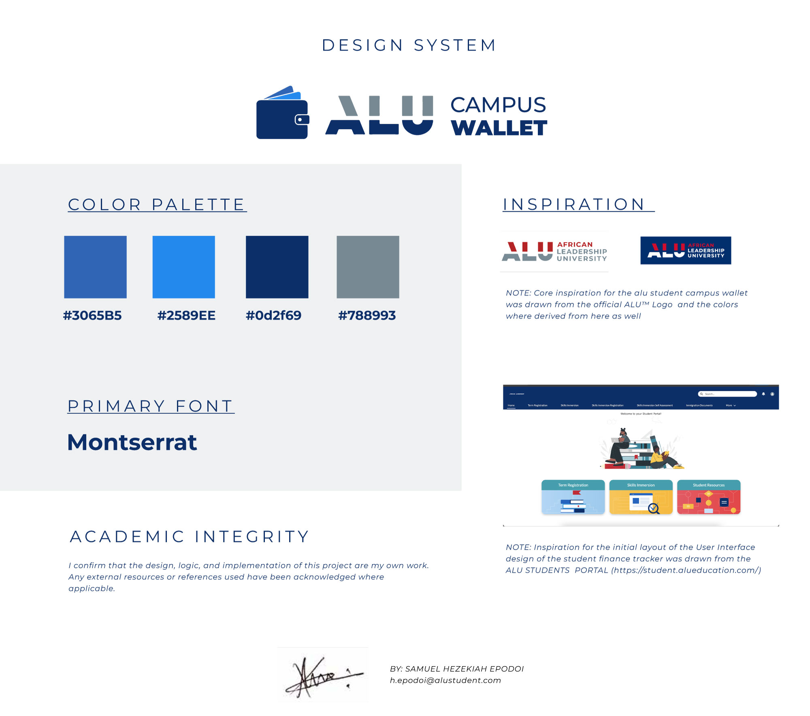
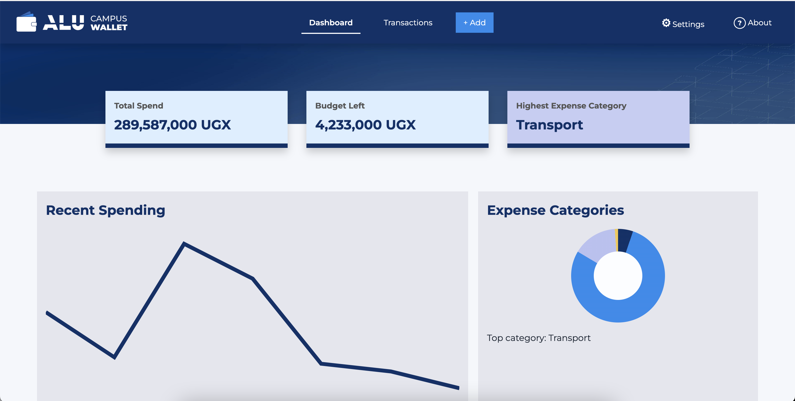

# ALU Campus Wallet

- **Author:** Samuel Hezekiah Epodoi
- **Email:** h.epodoi@alustudent.com
- **Cohort:** Cohort 2 - Front End Web Application Development
- **Theme:** Student Finance Tracker
- **Repository:** https://github.com/sam-hez/alu-campus-wallet
- **GitHub Pages:** https://sam-hez.github.io/alu-campus-wallet/
- **Figma UI Wireframe:** https://www.figma.com/design/Sdkxpyrt6oZZRoOUaSFTRE/ALU-Campus-Wallet
- **Demo Video:** https://youtu.be/I0Yrqu1vIFQ

## Overview

ALU Campus Wallet is a vanilla HTML, CSS, and JavaScript finance tracker made for ALU students. It helps students record expenses, search and sort transactions, check recent spending, track budget limits, and import/export their data as JSON.

The project uses no frameworks. It was built to practice responsive UI, DOM manipulation, regex validation, regex search, localStorage persistence, JSON import/export, and basic accessibility.

## Design System / UI Logic



## Setup Guide

1. Clone the repository.
2. Open `index.html` in a browser, or use a local server such as Live Server.
3. Use the navigation bar to move between Dashboard, Transactions, Settings, and About.
4. To test sample data, import `seed.json` from the Settings page.

## Testing Guide

Run these checks from the project root:

```bash
node --check src/scripts/storage.js
node --check src/scripts/state.js
node --check src/scripts/ui.js
node --check src/scripts/validators.js
node --check src/scripts/search.js
node -e "JSON.parse(require('fs').readFileSync('seed.json','utf8')); console.log('seed ok')"
```

Manual checks:

- Add a valid transaction and confirm it appears in the table.
- Try invalid form values and confirm inline error messages appear.
- Refresh the browser and confirm records are still saved.
- Search with `coffee`, `coffee|bus`, and `[` to test safe regex handling.
- Sort by date, description, and amount.
- Edit and delete records.
- Change budget and currency settings.
- Export JSON, then import it again.
- Import `seed.json` and confirm 10+ records load.
- Test keyboard navigation with `Tab`, `Shift + Tab`, `Enter`, `Space`, and `Escape`.

## Features List

- Add, edit, and delete finance records.
- Records include `id`, `description`, `amount`, `category`, `date`, `createdAt`, and `updatedAt`.
- Regex validation with inline form errors.
- Live regex search with safe error handling.
- Case-sensitive search toggle.
- Search match highlighting with `<mark>`.
- Sorting by newest, oldest, description A-Z/Z-A, and amount low-high/high-low.
- Dashboard cards for total spend, budget left/over budget, and highest expense category.
- Recent spending line chart.
- Expense category donut chart.
- Budget progress bar and ARIA live budget message.
- Currency settings for RWF, UGX, and USD with manual rates.
- localStorage persistence.
- JSON import/export with validation.
- `seed.json` with 10+ sample records.
- Responsive layout for mobile, tablet, and desktop.
- Keyboard-friendly navigation and modal controls.

## Regex Catalog

| Purpose | Pattern | Example |
| --- | --- | --- |
| Description cannot start or end with spaces | `/^\S(?:.*\S)?$/` | `Lunch at campus` passes, ` Lunch` fails |
| Amount must be a valid number | <code>/^(0&#124;[1-9]\d*)(\.\d{1,2})?$/</code> | `2500` and `2500.50` pass |
| Date must use YYYY-MM-DD | <code>/^\d{4}-(0[1-9]&#124;1[0-2])-(0[1-9]&#124;[12]\d&#124;3[01])$/</code> | `2026-06-21` passes |
| Category uses letters, spaces, hyphens | `/^[A-Za-z]+(?:[ -][A-Za-z]+)*$/` | `Food`, `Mobile Data`, `Part-Time` pass |
| Duplicate word checker | `/\b(\w+)\s+\1\b/i` | `tea tea` fails |
| Search: coffee or bus | <code>coffee&#124;bus</code> | Finds descriptions with coffee or bus |
| Search: cents pattern | `\.\d{2}\b` | Finds amounts with two decimals |
| Search: invalid regex | `[` | Shows an invalid regex message instead of crashing |

## Keyboard Map

| Key | Action |
| --- | --- |
| `Tab` | Move forward through links, form fields, buttons, and table actions |
| `Shift + Tab` | Move backward through interactive items |
| `Enter` | Activate focused links and buttons |
| `Space` | Activate focused buttons and checkbox controls |
| `Escape` | Close the Add/Edit Transaction popup |

## Accessibility Notes

- The page uses semantic landmarks: `header`, `nav`, `main`, `section`, and `footer`.
- A skip-to-content link is available for keyboard users.
- Status messages use `role="status"` and `aria-live`.
- Budget status changes from polite to assertive when the user goes over budget.
- Focus styles are visible for keyboard navigation.
- The Add/Edit Transaction popup uses dialog attributes and can be closed with Escape.
- Tables use `data-label` values so records remain readable on smaller screens.
- The layout uses media queries for mobile, tablet, and desktop widths.

## Import and Export

The Settings page includes Export JSON and Import JSON controls.

Export creates a JSON file using this shape:

```json
{
  "settings": {},
  "records": []
}
```

Import checks that the JSON has valid `settings` and `records`. If the file is invalid, the current app data is kept and an error message is shown.

`seed.json` contains 11 diverse sample records, including small amounts, a large amount, recent dates, and edge dates.

## Code Structure

- `src/scripts/validators.js` checks form input using regex rules.
- `src/scripts/search.js` compiles regex search safely and highlights matches.
- `src/scripts/state.js` manages records, settings, sorting, totals, and import validation.
- `src/scripts/storage.js` handles localStorage plus JSON import/export helpers.
- `src/scripts/ui.js` connects the DOM, events, rendering, modal behavior, and page navigation.

## Academic Integrity and AI Usage

I confirm that this project was completed as my individual summative submission. AI support was used as a learning assistant for documentation wording, seed data preparation, and debugging explanations. ai did not write the code for me

## IMPORTANT NOTE: Github account clarification
I accidentally made all the commits on this project with my personal gmail github account ``samuelepodoi@gmail.com`` instead of ``h.epodoi@alustudent.com`` I hadn't done the git config on my local machine to change the account and if i changed to my school email to commit and push it would now show 2 contributors



